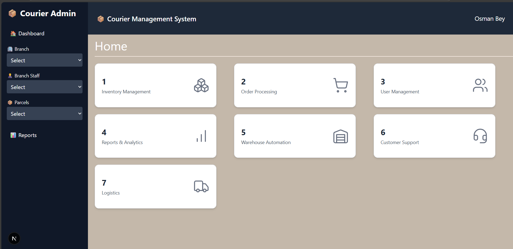

<h1 align="center">Hi, I'm Muhammad Usman 👋</h1>

A Full-Stack Web & Mobile Developer | JavaScript Enthusiast | API Builder | MERN/NEXT.JS Developer 🔥

  
  
  

---

## 🧠 About Me

I'm a **MERN & Next.js developer** with a strong passion for solving real-world problems using modern technologies. I specialize in creating full-stack applications, building REST APIs, and crafting responsive UIs that deliver great user experiences.

### What I do:
- 🔨 Build modern full-stack apps using **React, Node.js, and MongoDB**
- ⚡ Seamlessly implement **REST APIs** from scratch
- 🔥 Use **Firebase** for real-time features, authentication, and storage
- 🧠 Apply strong **problem-solving** and **analytical thinking**
- 🌍 Deploy full apps to platforms like **Vercel** and **Firebase Hosting**
- 💬 Open to freelance, remote roles, and exciting collaborations

---

## 🚀 Featured Projects

### 🧠 [AiTechBlog](https://github.com/usman918dev/AiTechBlog)  
A modern AI & tech blog built using **Next.js**, **Tailwind CSS**, and **Tiptap** for rich Markdown editing.  
🔗 [Live Demo](https://www.techolyze.com)  

---

### 🚚 [Courier Management System](https://github.com/usman918dev/courier-management-system)  
Courier delivery platform built using **MERN stack** with a focus on admin control and real-time updates.  
🔗 [Live Demo](https://courier-management-system-iota.vercel.app)  

---

### 🎉 [Event Management System](https://github.com/usman918dev/final-hackathon-SMIT)  
Event organizer app built with **MERN**, featuring role-based access and clean CRUD flows.

---

### ⚡ [Hackathon App](https://github.com/usman918dev/Hackathon)  
Hackathon-ready frontend using **React**, **Redux Toolkit**, and **Firebase Auth + Firestore**.

---

## 🛠️ Tech Stack & Tools

### 🚀 Frontend
`HTML` · `CSS` · `JavaScript (ES6+)` · `React` · `Next.js` · `React Router` · `Tailwind CSS` · `Tiptap Editor`

### 🔧 Backend
`Node.js` · `Express.js` · `MongoDB` · `Firebase (Auth, Firestore, Storage)` · `REST API`

### ⚙️ Tools & Platforms
`Git & GitHub` · `Vercel` · `Postman` · `VS Code` 

### ⚡Libraries & Api's
`Redux Toolkit` · `Mongoose` · `JWT` · `React Markdown` · `Nodemailer` 

---

## 📫 Let's Connect

- 📧 Email: [usman918khan@gmail.com](mailto:usman918khan@gmail.com)  
- 🌐 Portfolio: [techolyze.com](https://www.techolyze.com)  
- 🧑‍💻 GitHub: [@usman918dev](https://github.com/usman918dev)

---

> _“Code is like humor. When you have to explain it, it’s bad.”_  
> — Cory House

---

<!--
📌 Tip: Replace the image paths with hosted screenshots if not using GitHub Pages.
🚀 Make sure to keep this updated as you grow!
-->
