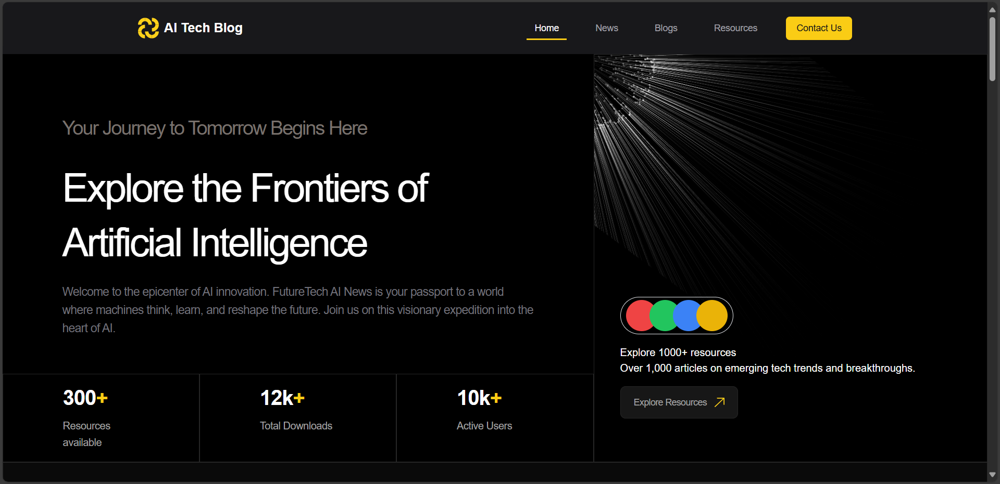

# Hi, I'm Muhammad Usman 👋

Welcome to my GitHub!  
I'm a **Web & Mobile Developer** who loves to learn modern technologies and build awesome digital products. Whether it's crafting clean UIs, solving real-world problems, or exploring new stacks — I'm always creating, improving, and leveling up. 🚀

---

## 🔥 Featured Projects

Take a look at some of the projects I've enjoyed building:

---

### 🧠 [AiTechBlog](https://github.com/osmanbey918/AiTechBlog)  
A modern AI and tech blog built with Next.js and Tailwind CSS.    
### 🧠 [Live Demo](https://www.techolyze.com)  

---

### 🚚 [Courier Management System](https://github.com/osmanbey918/courier-management-system)  
Web app for managing courier deliveries efficiently.  
🌐 [Live Demo](https://courier-management-system-iota.vercel.app)  

---

--- -->

### 🎉 [Event Management System](https://github.com/osmanbey918/final-hackathon-SMIT)  
Event management platform built using the MERN stack.  

---

### ⚡ [Hackathon Project](https://github.com/osmanbey918/Hackathon)  
Hackathon app built using React, Redux Toolkit, and Firebase (Auth, Firestore, Storage).  

---

## 👨‍💻 About Me

- 💡 Passionate about **modern web and mobile technologies**
- 🔥 Currently working with: **JavaScript**, **React**, **React Native**
- 🎯 Always improving my skills, one project at a time
- 🤝 Open to new ideas, collaborations, and freelance work
- 🧠 Love building tech that solves real problems — especially with AI & Firebase

---

## 📫 Let’s Connect

- GitHub: [@osmanbey918](https://github.com/usman-918)
- Email: *(usman918khan@gmail.com)*

---

> _“Code is like humor. When you have to explain it, it’s bad.”_  
> — Cory House

---
[Live Demo](https://www.techolyze.com)

